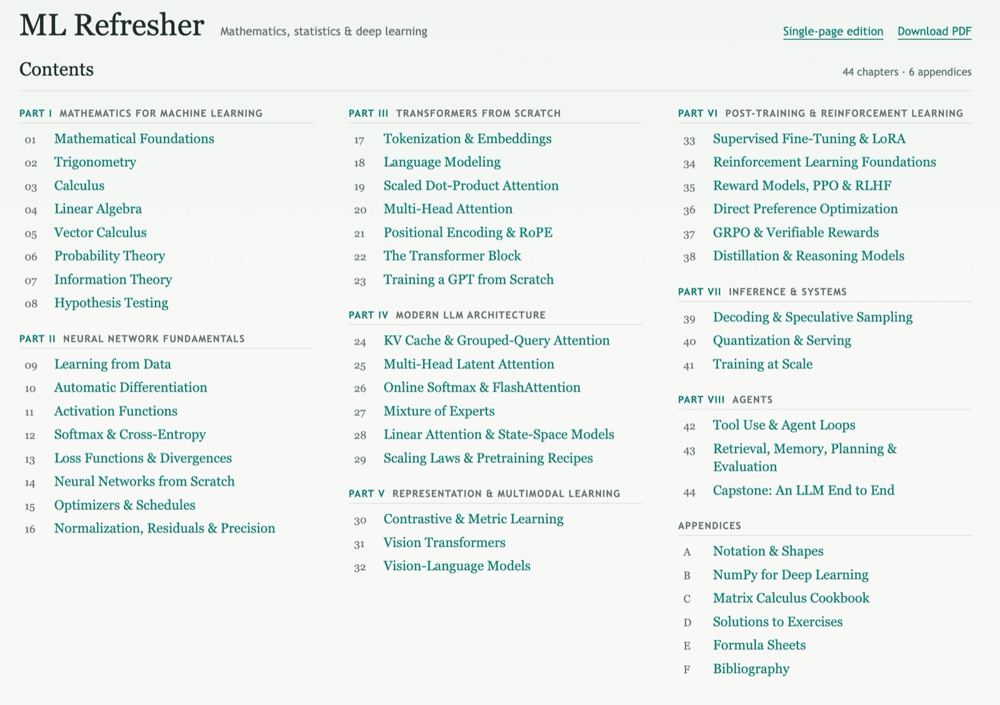

# ML Refresher

> [!WARNING]
> **AI-generated content.** AI tools generated most of this book, and experts have not
> reviewed or fact-checked it. It very likely contains errors, so use it at your own risk.
> Read the [disclaimer and content policy](DISCLAIMER.md), and report errors or copyright
> concerns at https://github.com/thammegowda/ml-refresh/issues.

A free, browser-based refresher on the mathematics and machine learning behind modern
large language models, from probability and calculus to transformers, reinforcement
learning from feedback, and agents.

- **Read online:** https://gowda.ai/ml-refresh/
- **Read offline:** the [PDF](https://gowda.ai/ml-refresh/ml-refresher.pdf) or the
  [single-page edition](https://gowda.ai/ml-refresh/book.html)

[](https://gowda.ai/ml-refresh/)

## What's inside

44 short chapters in eight parts, plus appendices:

1. **Mathematics for machine learning:** calculus, linear algebra, probability,
   information theory, and hypothesis testing
2. **Neural network fundamentals:** losses, automatic differentiation, activations,
   optimizers, and normalization
3. **Transformers from scratch:** tokenization, attention, positional encoding, and a small GPT
4. **Modern LLM architecture:** KV caches, grouped-query and latent attention,
   FlashAttention, mixture of experts, state-space models, and scaling laws
5. **Representation and multimodal learning:** contrastive learning, vision transformers,
   and vision-language models
6. **Post-training and reinforcement learning:** fine-tuning and LoRA, PPO, DPO, GRPO,
   and distillation
7. **Inference and systems:** decoding, quantization, and distributed training
8. **Agents:** tool use, retrieval, planning, evaluation, and an end-to-end capstone

Each chapter derives the key equations, implements them in NumPy with numerically checked
gradients, and ends with a short "Teach it" summary and exercises with solutions. The
interactive labs and notebooks run Python in your browser, with nothing to install.

## Build it yourself

You need Node.js 22+, Python 3.9+, and Asciidoctor (`gem install asciidoctor rouge`).

```sh
make setup   # install dependencies
make test    # run the tests
make build   # build the site into dist/
make pdf     # print dist/ml-refresher.pdf
make serve   # preview at http://localhost:1414/ml-refresh/
```

Every push to `main` is tested and deployed to GitHub Pages. The
[development guide](docs/DEVELOPMENT.md) explains how the book is built, tested, and written.

## Report a problem

Found an error, or content that may infringe someone's rights? Please
[open an issue](https://github.com/thammegowda/ml-refresh/issues) and say where it appears.
